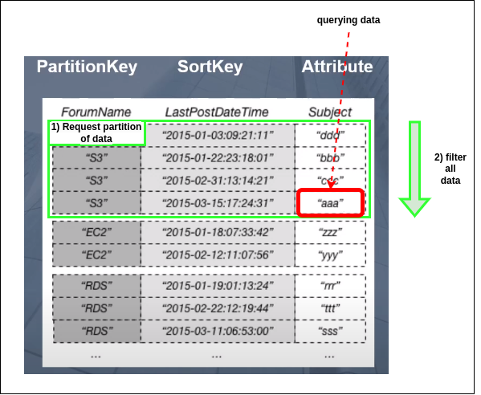

# Dynamo DB:

DynamoDB is one of the most popular and widely used NoSQL databases in today's market. 
It is a fully managed database offering and allows developers to focus on application 
development without worrying about managing the underlying infrastructure.

### 1) WCU / RCU:  
   - **Read Capacity Units:**
    
     - One **strongly consistent read** for a data block of up to 4 KB:
         1) **We want 10 objects by 4 KB per/sec:** (10 * 4) / 4 = 10SCR;
         2) **We want 10 objects by 6 KB per/sec:** (10 * 8 (round up)) / 4 = 20SCR;
     - Two **eventually consistent reads** for a data block of up to 4 KB:  
         1) **We want 16 objects by 12 KB per/sec:** (16 / 2) * (12 / 4) = 24ECR;

   - **Write Capacity Units:** One write request per/sec for a data block of up to 1 KB.
     Then larger item than more WRC:
     1) **We want 10 objects by 2 KB per/sec:** 2 * 10 = 20WCU;
     2) **We want 6 objects by 4.5 KB per/sec:** 6 * 5 (round up) = 30WCU;


### 2) API:  
  - **<ins>Table managing:</ins>**  
    - **CreateTable** – Creates a new table. Optionally, you can create one 
      or more secondary indexes, and enable DynamoDB Streams for the table.
    - **DescribeTable**– Returns information about a table, such as its primary 
      key schema, throughput settings, and index information.
    - **ListTables** – Returns the names of all of your tables in a list.
    - **UpdateTable** – Modifies the settings of a table or its indexes, creates
      or removes new indexes on a table, or modifies DynamoDB Streams settings for a table.
    - **DeleteTable** – Removes a table and all of its dependent objects from DynamoDB.
  - **<ins>Creating data:</ins>**  
    - **PutItem** – writes a single item or fully replace to a table.
    - **BatchWriteItem** – writes / replace up to 25 items to a table.
  - **<ins>Reading data:</ins>**   
    - **GetItem** – Retrieves a single item from a table.
    - **BatchGetItem** – Retrieves up to 100 items from one or more tables.
    - **Query** – Retrieves all items that have a specific partition key (=) 
      and sort key (=, >, <, <=, >=, begin, between) with filtering.
      
    - **Scan (no indexing used)** – Retrieves all items in the specified table 
      or index and then filter them. Use only for getting large amount of data.
      
  - **<ins>Updating data:</ins>**   
    - **UpdateItem** – Modifies one or more attributes in an item. Y
  - **<ins>Deleting data:</ins>**   
    - **DeleteItem** – Deletes a single item from a table.
    - **BatchWriteItem** – Deletes up to 25 items from one or more tables.

### 3) Primary keys: Partition key / Partition key + Sort key:  
**Primary Key** - are used for uniquely identifying each item in a table. No two-item 
can have the same primary key. In DynamoDB the primary key must be specified along 
with the table name while creating a table.

1) **Partition key** - a partition key is a type of primary key which is used by DynamoDB 
   as input values for internal hash functions. These hash functions are further 
   responsible for generating partitions where the data items can be stored.

   

2) **Partition key + Sort key (composite primary key)** - combination of keys must be unique.
   If the table has a composite primary key (partition key and sort key), DynamoDB
   calculates the hash value of the partition key in the same way as described 
   for Partition key. However, it stores all the items with the same 
   partition key value physically close together, ordered by sort key value.

   .png)

   **Sort key** adds the ability to sort partition keys by sort key.  
   **For example:**
      - primary key: user_id;
      - sort key: Date;
   **Query:** 
   ```js
    await dynamodb.getItem({ Key: { user_id: 'f5rgf526g546346tgd', date: '2022/06/22' }}).promise()
   ```

### 4) Indexing: LSI, GSI:   
Because secondary indexes consume storage and provisioned throughput, you should keep the
size of the index as small as possible. Also, the smaller the index, the greater the 
performance advantage compared to querying the full table.

  - **Local secondary index** — an index that has the same partition key as the base table,
    but a different sort key. A local secondary index is "local" in the sense that every 
    partition of a local secondary index is scoped to a base table partition that has the
    same partition key value. Max 5 per table. Must be defined when creating table.

    

  - **Global secondary index** — an index with a partition key and a sort key that can be 
    different from those on the base table. A global secondary index is considered 
    "global" because queries on the index can span all of the data in the base table, 
    across all partitions. Can be added to existing table.

    

### 5) Concurrency:  
**Concurrency (Optimistic locking) / Realization of Isolation lvl but without atomic lvl** 
is a strategy to ensure that the client-side item that you are updating
(or deleting) is the same as the item in Amazon DynamoDB. If you use this strategy, your 
database writes are protected from being overwritten by the writes of others, and vice versa.

With optimistic locking, each item has an attribute that acts as a version number. If you
retrieve an item from a table, the application records the version number of that item. 
You can update the item, but only if the version number on the server side has not changed.


### 6) DAX:  
DAX is a DynamoDB-compatible caching service that enables you to benefit from fast in-memory 
performance for demanding applications. DAX addresses three core scenarios:

  1) As an in-memory cache, DAX reduces the response times of eventually consistent read 
  workloads by an order of magnitude from single-digit milliseconds to microseconds.
  2) DAX reduces operational and application complexity by providing a managed service 
  that is API-compatible with DynamoDB. Therefore, it requires only minimal functional
  changes to use with an existing application.
  3) For read-heavy or bursty workloads, DAX provides increased throughput and potential 
  operational cost savings by reducing the need to overprovision read capacity units. 
  This is especially beneficial for applications that require repeated reads for individual keys.

### 7) Streams:  
### 8) TTL:  
### 9) Transactions:  
### 10) Partitions and data distribution:
Amazon DynamoDB stores data in partitions. A partition is an allocation of storage 
for a table, backed by solid state drives (SSDs) and automatically replicated across
multiple Availability Zones within an AWS Region.


### 11) Session state:  
